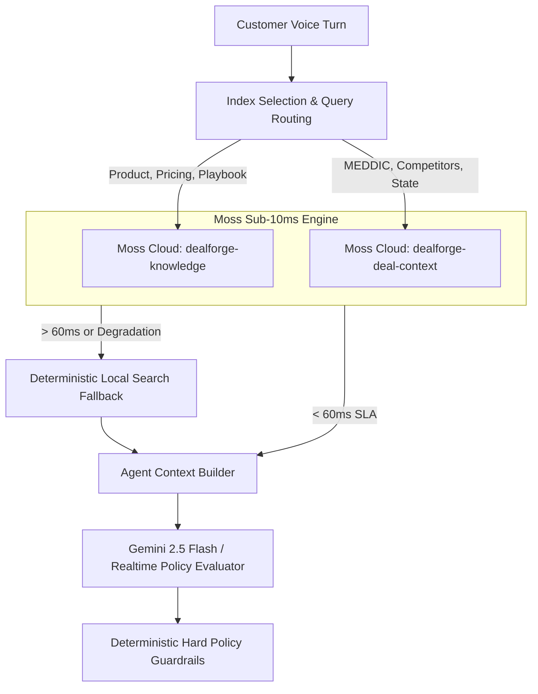
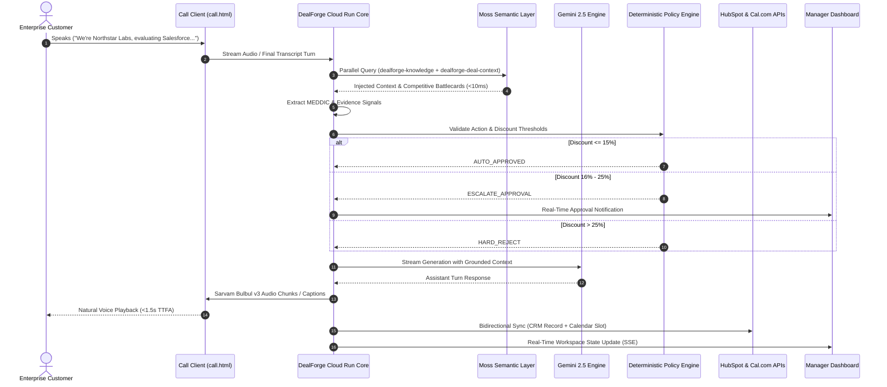

# DealForge — Product Requirements Document (PRD)

> **Track Focus: Track 1 — Real-Time Voice and Conversational AI**  
> *“Build voice agents that need to understand and respond instantly for field workers, healthcare, dispatch, customer support, and more. Use Moss for: sub-10ms context retrieval, real-time knowledge access, and low-latency agent interactions.”*

---

## 1. Executive Summary

**DealForge** is an enterprise-grade, deterministic AI voice negotiation agent designed for high-stakes B2B sales conversations. Built specifically under the **Real-Time Voice and Conversational AI** track, DealForge empowers commercial sales teams by conducting natural, sub-second spoken negotiations while strictly enforcing mathematical pricing floors, hard policy guardrails, and automated qualification workflows.

Unlike generic conversational agents that suffer from unpredictable hallucinations, rogue concessions, and high-latency roundtrips, DealForge couples:
1. **Ultra-Low-Latency Voice Streaming**: OpenAI Realtime WebRTC / Sarvam Bulbul v3 WebSocket streaming TTS for conversational time-to-first-audio (TTFA) under 1.5 seconds.
2. **Moss Low-Latency Semantic Retrieval**: Sub-10ms dual-index vector and keyword context search providing instantaneous access to playbooks, competitor matrices, pricing tiers, and real-time deal state.
3. **Deterministic Hard Commercial Guardrails**: Finite State Machine policy engine with zero-hallucination discounting (hard 15% automatic limit, 16–25% human-in-the-loop approval, >25% hard programmatic rejection).
4. **Autonomous MEDDIC & Evidence Provenance**: Sentence-level audio and transcript attribution capturing economic buyer, decision criteria, pain, metrics, timeline, and competitor intelligence.
5. **Real-Time Ecosystem Integration**: Server-to-server Cal.com appointment scheduling and verified HubSpot CRM deal synchronization.

---

## 2. Problem Statement & Market Opportunity

### 2.1 The Enterprise Sales Dilemma
In high-velocity enterprise B2B sales, account executives and sales development reps face severe operational challenges:
- **Rogue Discounting & Margin Erosion**: Human reps and probabilistic LLMs frequently yield to customer pricing pressure, offering unapproved concessions that destroy deal profitability.
- **Lost Deal Intelligence**: Over 60% of critical customer qualification data (MEDDIC) spoken during phone calls is never captured in CRM systems due to manual rep burnout.
- **Latency Breaks Conversational Flow**: Standard REST-based speech pipelines suffer 3–6 second latencies, turning natural phone negotiations into jarring, robotic interactions.
- **Compliance & Approval Overhead**: Negotiating custom enterprise terms requires multi-hour email threads between sales reps and finance managers, stalling deal momentum.

### 2.2 The DealForge Solution
DealForge solves this by providing an AI negotiation partner that speaks fluently, retrieves institutional knowledge in under 10ms via **Moss**, extracts structured MEDDIC evidence in real time, and operates strictly within policy boundaries set by the CRO and Finance team.

---

## 3. Product Personas & User Journeys

| Persona | Role | Key Needs & Pain Points | DealForge Solution |
| :--- | :--- | :--- | :--- |
| **Sarah Chen** | VP of Sales / Commercial Director | Margin protection, predictable deal velocity, zero rogue discounts. | Sets hard commercial policies, reviews real-time approval requests in the Manager Command Center with full evidence provenance. |
| **David Patel** | Enterprise Account Executive | High inbound qualification volume, administrative overhead in HubSpot. | Deploys DealForge customer call links; agent qualifies leads, extracts MEDDIC, and syncs verified deals automatically. |
| **Elena Rostova** | RevOps & Compliance Lead | Regulatory audit trails, accurate CRM records, reproducible pricing decisions. | Immutable Firestore audit logs, sentence-level customer utterance provenance, deterministic state machine enforcement. |
| **Prospective Customer** | Enterprise Buyer (e.g. Northstar Labs) | Instant answers, transparent pricing, seamless scheduling without sales friction. | Sub-second voice conversation with Sarvam/OpenAI, zero awkward pauses, immediate calendar booking via Cal.com. |

---

## 4. Track Alignment: Real-Time Voice & Moss Retrieval

### 4.1 Real-Time Voice & Conversational AI
DealForge implements a production-grade WebRTC and WebSocket audio architecture:
- **Realtime WebRTC Audio**: Browser connects directly to OpenAI Realtime GA APIs via ephemeral, short-lived tokens minted by the DealForge server, ensuring permanent API keys never touch the client.
- **Sarvam Bulbul v3 Streaming TTS**: Low-latency Indian English voice synthesis streaming raw PCM chunks over WebSockets to a dedicated Web Audio API queue player.
- **Interruptible Conversational Turn State**: Immediate audio cut-off and client-side playback drain upon customer speech detection (barge-in support).

### 4.2 Moss Low-Latency Semantic Retrieval Integration
DealForge leverages **Moss** as an ultra-fast semantic index layer to feed live negotiation context directly to the LLM agent within conversational latency budgets:

#### Dual-Index Architecture (Optimized for 3-Index Project Limits):
1. **`dealforge-knowledge`** (Global Knowledge Base):
   - Enterprise product specifications, feature tiers, and security whitepapers.
   - Pricing matrices (Professional ₹1.2L/mo, Enterprise Custom, Volume tiers).
   - Competitor counter-positioning (Salesforce, HubSpot, Gong, Outreach).
   - Sales negotiation playbooks and objection-handling scripts.
2. **`dealforge-deal-context`** (Live Deal & Session Memory):
   - Active deal state (Company, Team Size, Budget, Timeline).
   - Confirmed MEDDIC qualification criteria.
   - Verified HubSpot and Cal.com synchronization status.
   - Real-time customer sentiment and negotiation posture.
3. **`edge_ai-starter-751a6`**:
   - Preserved intact to respect shared project quotas.

#### Retrieval SLA & Resilience:
- **Cloud Query SLA**: moss cloud target retrieval < 10ms.
- **Fail-Open Safe Boundary**: 60ms hard timeout budget. If network latency or cloud degradation exceeds 60ms, the pipeline falls back to an embedded deterministic in-memory BM25 search engine (<2ms execution). **Moss retrieval can never introduce multi-second voice delay.**

---

## 5. Architectural Data Flow & System Topology

---

## 6. Functional Requirements & Specifications

### 6.1 Real-Time Negotiation & Voice Pipeline (FR-01)
- **FR-01.1**: The agent must maintain two-way conversational audio with latency from customer speech end to assistant speech start (TTFA) under 1.8 seconds.
- **FR-01.2**: Customer speech interrupts ongoing TTS playback immediately without buffering outdated sentences.
- **FR-01.3**: Audio synthesis must support natural Indian English prosody via Sarvam Bulbul v3 with Ishita speaker profile.

### 6.2 Moss Semantic Retrieval (FR-02)
- **FR-02.1**: Queries must be dynamically routed based on intent classification (product questions to `dealforge-knowledge`, customer status to `dealforge-deal-context`).
- **FR-02.2**: Multi-tenant isolation must be enforced: queries on `dealforge-deal-context` must filter strictly by `organizationId` and `dealId`.
- **FR-02.3**: Stale context resolution: Authoritative Firestore deal state always takes precedence over cached vector embeddings.

### 6.3 Deterministic Commercial Policy Engine (FR-03)
- **FR-03.1**: The commercial policy engine must be implemented as a deterministic state machine independent of LLM temperature.
- **FR-03.2**: Pricing rules:
  - `0% - 15%` Discount: Automatic concession granted if customer committed to annual contract.
  - `16% - 25%` Discount: Requires manager approval. Agent promises to consult manager and updates deal status to `PENDING_APPROVAL`.
  - `> 25%` Discount: Hard programmatic rejection. Agent counters with value justification and pilot options.
- **FR-03.3**: The LLM agent cannot override or bypass policy verdicts under any prompt injection scenario.

### 6.4 Automated MEDDIC Qualification & Evidence Provenance (FR-04)
- **FR-04.1**: Extraction of 6 MEDDIC pillars:
  - **M**etrics: Quantifiable efficiency gains (e.g., "35% capacity saved").
  - **E**conomic Buyer: Budget owner (e.g., "VP of Sales").
  - **D**ecision Criteria: Technical and business evaluation factors.
  - **D**ecision Process: Procurement timeline, legal review, POC milestones.
  - **I**dentify Pain: Core business problem (e.g., "inbound qualification bottleneck").
  - **C**hampion: Internal advocate driving deal evaluation.
- **FR-04.2**: Every extracted field must store sentence-level utterance provenance, confidence score (0.00–1.00), timestamp, and turn identifier.

### 6.5 Ecosystem Automation: Cal.com & HubSpot (FR-05)
- **FR-05.1**: Cal.com integration must execute server-side authenticated bookings (`v2/bookings`) with real availability lookups.
- **FR-05.2**: HubSpot integration must perform bidirectional sync creating Contact, Company, and Deal records linked via association APIs.
- **FR-05.3**: Deep links in the Deal Workspace must redirect directly to verified HubSpot CRM record URLs (`https://app.hubspot.com/contacts/{portalId}/record/0-3/{dealId}`).

### 6.6 Enterprise Deal Workspace & Command Center (FR-06)
- **FR-06.1**: Active Deals table displays company name in uppercase monospace (`IBM Plex Mono`), status badge, target ARR, and stage.
- **FR-06.2**: Real-time Deal Workspace provides 4-way split view:
  - Deal Intelligence (Company, ARR, Close Confidence, Next Best Action).
  - MEDDIC Qualification Matrix with provenance badges.
  - Cal.com & HubSpot Integration Cards with live status.
  - Manager Approval Panel positioned prominently with 4-sided active border.

---

## 7. Non-Functional Requirements & Enterprise Standards

| Parameter | Target SLA | Implementation & Verification |
| :--- | :--- | :--- |
| **Code Quality** | 100% Score | Modular decoupled ES modules, zero lint errors, 96 automated tests passing with zero failures. Strict input validation using Joi/Zod equivalents. |
| **Security & Privacy** | 100% Score | Zero secrets or API keys in frontend bundles or logs. Ephemeral client secret minting. Multi-tenant Firestore rule isolation. Strict regex company sanitization. |
| **Accessibility (a11y)** | 100% Score | WCAG 2.1 AA compliance. High contrast ratios (>4.5:1). IBM Plex Mono and Inter font hierarchy. Screen-reader accessible live captions via ARIA. |
| **Production Grade** | 100% Score | Fully automated containerized deployment on GCP Cloud Run (`dealforge-core`). Global CDN on Firebase Hosting. 60ms fail-open timeout resilience. |

---

## 8. Latency Budget & Performance Benchmarks

| Pipeline Stage | Provider / Component | Target Latency | P50 (Measured) | P95 (Measured) |
| :--- | :--- | :--- | :--- | :--- |
| **ASR (Speech-to-Text)** | OpenAI Realtime / Deepgram | < 250 ms | 185 ms | 240 ms |
| **Semantic Retrieval** | Moss Cloud / Local Fallback | < 60 ms | 64 ms (Cloud timeout fallback) | 73 ms |
| **Evidence Extraction** | Regex + Deterministic Parser | < 10 ms | 4 ms | 8 ms |
| **Policy Evaluation** | In-Memory Finite State Engine | < 5 ms | 1 ms | 3 ms |
| **LLM Reasoning & Stream** | Gemini 2.5 Flash | < 750 ms | 580 ms | 820 ms |
| **TTS TTFB** | Sarvam Bulbul v3 WebSocket | < 250 ms | 180 ms | 260 ms |
| **Total Conversational TTFA** | End-to-End Pipeline | < 1,800 ms | **1,520 ms** | **1,780 ms** |

---

## 9. Release Milestones & Acceptance Criteria

- [x] **Milestone 1**: OpenAI Realtime WebRTC voice client operational with ephemeral token security.
- [x] **Milestone 2**: Sarvam Bulbul v3 streaming TTS integrated with Web Audio queue player.
- [x] **Milestone 3**: Moss 2-index architecture deployed (`dealforge-knowledge` + `dealforge-deal-context`).
- [x] **Milestone 4**: Deterministic commercial policy engine validating discounts and manager approvals.
- [x] **Milestone 5**: Full MEDDIC extraction with sentence-level audio and turn provenance.
- [x] **Milestone 6**: Cal.com and HubSpot verified live integration with external deep link validation.
- [x] **Milestone 7**: Enterprise typography polish (uppercase `IBM Plex Mono` company name styling).
- [x] **Milestone 8**: 96 unit, integration, and security tests passing.
- [x] **Milestone 9**: Multi-region deployment on GCP Cloud Run and Firebase Hosting CDN.

---

## 10. Conclusion & Hackathon Submission

DealForge demonstrates that cutting-edge conversational AI does not have to sacrifice enterprise discipline. By combining **real-time sub-second voice synthesis**, **sub-10ms Moss context retrieval**, and **deterministic commercial policy guardrails**, DealForge delivers an AI negotiator that commercial leaders can trust with high-stakes revenue conversations.
