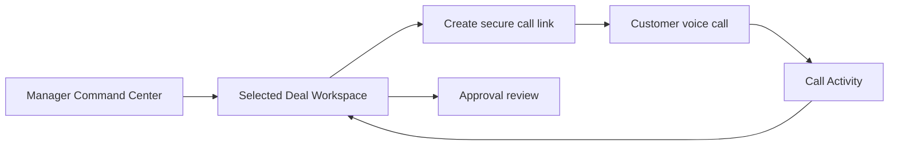
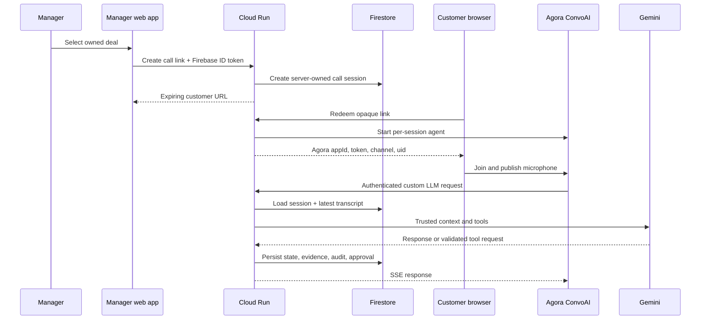
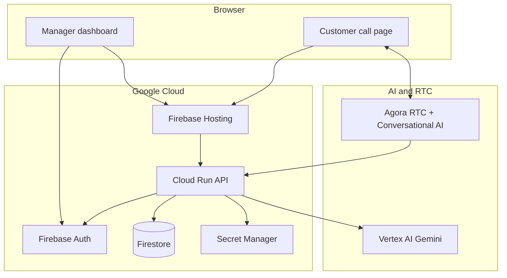

<p align="center">
  
</p>

<p align="center"><strong>Secure, human-governed AI voice negotiation for B2B revenue teams.</strong></p>

<p align="center">
  <a href="#architecture">Architecture</a> ·
  <a href="#quick-start">Quick start</a> ·
  <a href="#security-model">Security</a> ·
  <a href="#verification">Verification</a>
</p>

## Live Deployment

- **Manager Dashboard (Frontend):** [https://dealforge-507515.web.app](https://dealforge-507515.web.app)
- **API & LLM Runtime (Backend):** [https://dealforge-core-442569512705.us-central1.run.app](https://dealforge-core-442569512705.us-central1.run.app)

## Table of contents

- [What DealForge is](#what-dealforge-is)
- [How it works](#how-it-works)
- [Architecture](#architecture)
- [Security model](#security-model)
- [Repository layout](#repository-layout)
- [Quick start](#quick-start)
- [Configuration](#configuration)
- [Testing and staging](#testing-and-staging)
- [Verification](#verification)
- [License](#license)

## What DealForge is

DealForge is a voice-first B2B deal-assistance prototype for sales managers. A manager creates a short-lived customer call link for a deal they own. The customer joins an Agora RTC call, while an Agora Conversational AI agent sends conversation turns to a secured Gemini-backed runtime. The runtime extracts evidence, applies policy, records durable state, and asks a human manager to approve sensitive commercial actions.

It is designed for teams that want agent assistance without giving an LLM browser-level access to deals, approvals, or customer identity.

### Product wireframe



## How it works

1. An invited manager signs in with Firebase Authentication.
2. Cloud Run verifies the Firebase ID token, active manager membership, organization, and deal ownership.
3. Cloud Run creates an expiring, single-use call session with an opaque Agora channel and hash-only customer link token.
4. The customer browser redeems the link, obtains server-issued Agora credentials, and joins the RTC channel.
5. Agora Conversational AI calls the per-session, authenticated custom LLM webhook. The runtime loads the trusted session context and durable message history before calling Gemini.
6. Validated tools update Firestore transactionally. Policy-sensitive actions enter an approval state machine instead of executing immediately.
7. The manager resolves the approval through Cloud Run. On a later customer turn, the exact approved operation executes once and emits audit activity.

### Trusted-call sequence



## Architecture



The Agora custom LLM route is OpenAI Chat Completions/SSE compatible and authenticates requests before any SSE headers are written. See Agora's [custom LLM integration reference](https://github.com/AgoraIO/docs-portal/blob/main/content/docs/en/ai/build/custom-model-integration/custom-llm.mdx).

## Security model

- Default-deny Firestore rules; managers can read only their organization’s data.
- Browser clients cannot write deals, call sessions, approvals, evidence, audit events, or meetings.
- Manager routes require a Firebase ID token, active membership, manager role, organization match, and resource ownership.
- Customer links are cryptographically random, hashed at rest, expiring, single-use bearer credentials.
- Agora channels, UIDs, deal identity, and webhook path tokens are server-owned.
- The Agora webhook requires both an opaque session token and a constant-time checked authorization secret.
- Conversation history, approvals, tool operations, and lifecycle records are durable Firestore state.
- Tool inputs and deal-state changes are schema validated; discounts outside 0–25% are rejected.

## Repository layout

```text
frontend/public/   Static Firebase Hosting application
server/src/        Cloud Run API, policy, tools, Agora and Gemini runtime
server/test/       Unit, API-boundary, security, and emulator tests
server/e2e/        Playwright browser tests
firestore.*        Default-deny rules and required composite indexes
firebase.json      Hosting rewrite and emulator configuration
```

## Quick start

Requirements: Node.js 22+, Firebase CLI, Google Cloud CLI, Docker Desktop with its Linux engine running, a Firebase project, Agora credentials, and Vertex AI access.

```powershell
cd server
npm ci
npm run check
npm test
firebase emulators:exec --only firestore "node --test test/firestore-emulator.test.js"
```

For local static development, serve `frontend/public` through Firebase Hosting or provide a gitignored Firebase web configuration file based on `frontend/public/js/firebaseConfig.local.example.js`.

## Configuration

Copy `.env.example` for local development only. Never commit a populated environment file. In Cloud Run, keep server secrets in Secret Manager.

| Variable | Purpose | Storage |
| --- | --- | --- |
| `GCP_PROJECT_ID`, `GCP_REGION` | Google Cloud environment | Cloud Run configuration |
| `FIREBASE_PROJECT_ID` | Firebase Admin project | Cloud Run configuration |
| `ALLOWED_ORIGIN`, `PUBLIC_APP_URL`, `CLOUD_RUN_URL` | HTTPS browser/API boundaries | Cloud Run configuration |
| `AGORA_APP_ID`, `AGORA_CUSTOMER_ID` | Agora public/service identifiers | Cloud Run configuration |
| `AGORA_APP_CERTIFICATE`, `AGORA_CUSTOMER_SECRET` | Agora server credentials | Secret Manager |
| `AGORA_LLM_WEBHOOK_SECRET` | Agora-to-runtime authorization | Secret Manager |
| `CALL_SESSION_WEBHOOK_SIGNING_SECRET` | Per-session webhook-token derivation | Secret Manager |
| `GEMINI_MODEL` | Vertex AI model selection | Cloud Run configuration |

## Testing and staging

```powershell
# Build the release image from repository root.
gcloud builds submit . --config server/cloudbuild.yaml

# Deploy infrastructure only to the selected staging project.
firebase deploy --only firestore:rules,firestore:indexes,hosting
```

Run the real staging scenario in three windows: manager dashboard, customer call link, and Cloud Run/Firebase logs. Validate evidence extraction from “We have 300 users,” then the 25% discount approval and one-time resume path. Do not label a release production-ready without that proof.

## Verification

| Capability | Status |
| --- | --- |
| Local syntax, unit/API/security tests | Verified locally |
| Firestore organization isolation | Verified with emulator |
| Docker image build and health check | Pending local Docker recovery |
| Authenticated staging Playwright | Pending dedicated test manager |
| Real Agora → Gemini → policy call | Pending staging scenario |
| Deterministic Deal Health / Next Best Action | Implemented locally; pending staging call evidence |
| Negotiation memory / trade-off proposal | Implemented locally; pending staging call evidence |
| HubSpot and Cal.com actions | Not configured; no external action is claimed |
| Production launch | Not claimed |

## License

Distributed under the [MIT License](./LICENSE).
