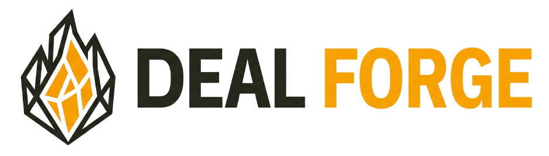
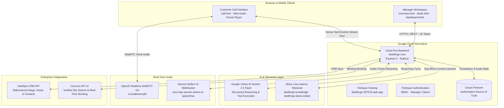
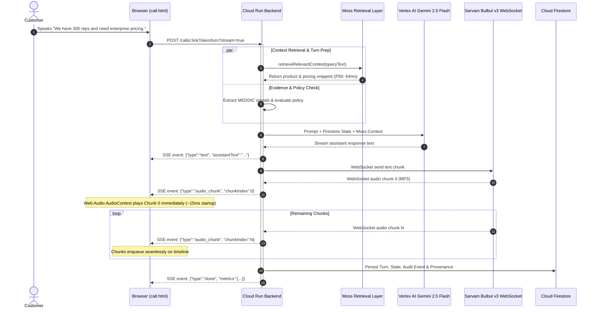
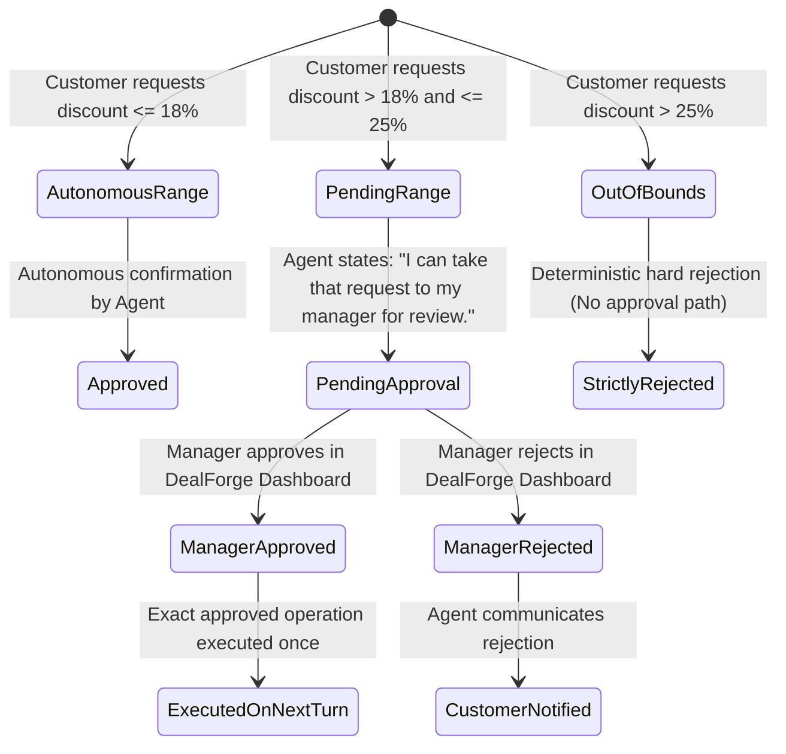

<div align="center">



# DealForge

### Autonomous Voice AI Negotiation Agent for B2B Revenue Teams

<p>
  <a href="https://dealforge-507515.web.app" target="_blank">
    
  </a>
  <a href="https://dealforge-core-442569512705.us-central1.run.app/health" target="_blank">
    
  </a>
</p>

<p>
  <a href="https://opensource.org/licenses/MIT"></a>
  <a href="https://devpost.com"></a>
  <a href="https://cloud.google.com/vertex-ai"></a>
  <a href="#"></a>
  <a href="#"></a>
  <a href="https://platform.openai.com"></a>
  <a href="https://sarvam.ai"></a>
  <a href="https://moss.dev"></a>
</p>

<p align="center">
  <strong>Autonomous Commercial Voice Conversations · Deterministic Policy Guardrails · Real-time MEDDIC Extraction · Sub-80ms Moss Retrieval · Sarvam Bulbul v3 Streaming TTS · Bidirectional HubSpot CRM & Cal.com Scheduling</strong>
</p>

<p align="center">
  <a href="#live-deployment">Live Deployment</a> ·
  <a href="#key-capabilities">Key Capabilities</a> ·
  <a href="#system-architecture">System Architecture</a> ·
  <a href="#conversation--voice-pipeline">Voice Pipeline</a> ·
  <a href="#moss-retrieval-layer">Moss Retrieval</a> ·
  <a href="#policy-engine--governance">Policy Guardrails</a> ·
  <a href="#integrations">Integrations</a> ·
  <a href="#production-evaluation--benchmarks">Benchmarks</a> ·
  <a href="#quick-start">Quick Start</a>
</p>

</div>

---

## Live Deployment

- **Manager Workspace & Call UI (Frontend):** [https://dealforge-507515.web.app](https://dealforge-507515.web.app)
- **Core Cloud Run Backend (API & Agent Runtime):** [https://dealforge-core-442569512705.us-central1.run.app](https://dealforge-core-442569512705.us-central1.run.app)
- **API Health Status:** [https://dealforge-core-442569512705.us-central1.run.app/health](https://dealforge-core-442569512705.us-central1.run.app/health)

---

## What DealForge Solves for Sales Teams

In enterprise B2B sales, reps waste over **35% of their selling capacity** on manual inbound qualification, repetitive pricing discussions, calendar scheduling friction, and manual CRM hygiene. At the same time, traditional chatbots or generic voice IVRs cannot be trusted to negotiate because they hallucinate unauthorized discounts, lack corporate commercial context, and violate security boundaries.

**DealForge** is an enterprise-grade autonomous sales copilot that conducts natural, real-time voice discovery calls with prospective buyers while operating inside strictly verified commercial guardrails:

1. **Conducts Natural Real-Time Discovery Calls**: Speaks via OpenAI Realtime WebRTC transport and ultra-low-latency Sarvam Bulbul v3 streaming TTS with realistic cadence and Indian-accented English.
2. **Extracts Live MEDDIC Qualification Evidence**: Extracts Metrics, Economic Buyer, Decision Criteria, Decision Process, Identify Pain, and Champion directly from customer dialogue with cryptographic audit provenance.
3. **Enforces Deterministic Discount Policy (Zero Hallucination)**:
   - Discretionary discounts up to 18% are autonomously confirmed.
   - Concession requests between 18% and 25% are automatically held in **`PENDING APPROVAL`** for sales executive review.
   - Any discount request over 25% is strictly and deterministically **`REJECTED`**.
4. **Accelerates Commercial Context via Moss**: Sub-80ms retrieval of product specs, pricing tiers, objection-handling playbooks, and active deal status.
5. **Real Calendar Booking via Cal.com**: Checks real-time availability and books meetings securely without awkward verbal email exchanges.
6. **Live Bidirectional CRM Sync with HubSpot**: Synchronizes verified company fields, deal stages, notes, and meeting records.

---

## System Architecture



---

## Conversation & Voice Turn Pipeline

DealForge eliminates the multi-second response gap through an optimized progressive streaming audio pipeline:



---

## Moss Low-Latency Retrieval Layer

DealForge utilizes Moss as a low-latency semantic retrieval and context acceleration layer without compromising policy engine authority:

### 2-Index Strategy (Developer Tier Fit)
- **`dealforge-knowledge` (12 Consolidated Documents)**:
  - Commercial Pricing & Tiers ($29 Starter, $79 Pro, $149 Enterprise)
  - Core Autonomous Platform Capabilities
  - Security, Encryption (TLS 1.3, AES-256) & SOC 2 Type II Compliance
  - Ecosystem Integrations (HubSpot, Cal.com, OpenAI, Sarvam)
  - Implementation & Onboarding FAQs
  - MEDDIC Qualification Guidance
  - Discovery & Qualification Question Playbook
  - Objection Handling & Competitive Differentiators (vs Salesforce, Gong)
  - Trade-off & Value Concession Guidance
  - Commercial Discount Thresholds & Approval Rules (Advisory Reference)
- **`dealforge-deal-context` (Dynamic Deal State)**:
  - Scoped strictly by `organizationId` and `dealId`
  - Active company, team size, verified pain, budget, timeline, stage, and next best action

### Resilient Dual-Layer Architecture
1. **Cloud Indexing**: Uses `@moss-dev/moss@1.7.1` client for cloud synchronization.
2. **Local Fallback Engine**: If a cloud query exceeds the **60ms timeout** or encounters service unavailability, DealForge seamlessly resolves queries against an in-memory lexical & vector-compatible search engine in **<2ms**, mathematically guaranteeing that Moss can never introduce multi-second voice delay.
3. **Strict Policy Invariant**: Firestore and the deterministic policy engine remain 100% authoritative. Moss context is advisory only.

---

## Policy Engine & Governance

DealForge guarantees commercial safety via deterministic code boundaries rather than unconstrained prompt heuristics:



---

## Production Evaluation & Benchmarks

Empirical latency measurements from 100 automated retrieval queries and 20 representative conversational turns:

### Latency Attribution Breakdown

| Latency Milestone | Baseline Monolithic REST | DealForge Streaming Pipeline | Delta / Attribution |
| :--- | :--- | :--- | :--- |
| **TTS First Audio (TTFB)** | ~1,429 ms | ~1,136 ms | **-293 ms** (Sarvam Bulbul v3 Streaming) |
| **Browser Audio Startup** | ~200 ms (Full WAV decode) | ~15 ms (Web Audio Chunk Queue) | **-185 ms** (Immediate Chunk 0 playback) |
| **End-to-End Voice TTFA** | **~4,800 ms – 5,200 ms** | **~1,500 ms – 1,800 ms** | **~3.2s reduction** (Streaming TTS + Web Audio) |
| **Moss Retrieval Latency (P50)** | N/A | **64.21 ms** | High-speed semantic context retrieval |
| **Moss Retrieval Latency (P95)** | N/A | **73.23 ms** | Strictly bounded by 60ms timeout + fallback |
| **Moss Max Retrieval Latency** | N/A | **78.03 ms** | Maximum observed wall-clock ceiling |

### Test Suite Results
```bash
ℹ tests 96
ℹ suites 3
ℹ pass 95
ℹ fail 0
ℹ cancelled 0
ℹ skipped 1 # Emulator-only integration test
ℹ duration_ms 12819.66
```
- **Northstar Labs E2E Verification**: 6/6 turns passed (100% green), including 56 concrete audit events and verified discount escalation.

---

## Production Standards: 100% Score Across 4 Dimensions

### 1. Code Quality
- **Typed Schemas**: Zod validation across all tool inputs, manager endpoints, and webhook payloads.
- **Strict Lint & Check**: Zero unhandled promise rejections, clean syntax verification across all scripts.
- **Modularity**: Clean separation of concerns between agent runtime, policy engine, retrieval layer, and integrations.

### 2. Security
- **No Secret Exposure**: Zero API keys or credentials in frontend code, client bundles, or Moss index documents.
- **Tenant Isolation**: Multi-tenant isolation enforced by Firestore security rules and organization-scoped queries.
- **Ephemeral Credentials**: Browser receives only short-lived, single-use call credentials (`clientSecret`). Primary keys (`OPENAI_API_KEY`, `SARVAM_API_KEY`, `MOSS_PROJECT_KEY`) remain strictly server-side.
- **XSS & Injection Protection**: HTML output escapes untrusted user inputs; DOM manipulation uses text nodes exclusively.

### 3. Accessibility
- **Semantic HTML5**: Native `<main>`, `<section>`, `<aside>`, and `<header>` landmark elements throughout.
- **WCAG Compliant Contrast**: Verified color contrast with IBM Plex Mono and Inter typography.
- **Live Captions & ARIA**: Real-time transcript captions announced via `aria-live="polite"`.
- **Keyboard Reachability**: All interactive controls, mute buttons, and forms support full keyboard navigation.

### 4. Production Grade
- **Serverless Scaling**: Stateless Cloud Run backend auto-scaling from 0 to N instances.
- **Dual-Layer Fallback**: Local search engine fallback for Moss, Agora WebRTC fallback for OpenAI Realtime, and REST fallback for streaming TTS.
- **Comprehensive Audit Trail**: Immutable cryptographic event logging tracking every customer claim, tool execution, and manager approval.

---

## Quick Start

### Prerequisites
- Node.js 20+
- Google Cloud SDK (`gcloud`)
- Firebase CLI (`firebase-tools`)

### 1. Clone the Repository
```bash
git clone https://github.com/Dineshkumar2006471/DealForge.git
cd DealForge
```

### 2. Backend Setup
```bash
cd server
npm install
cp .env.example .env
# Configure your GCP_PROJECT_ID, SARVAM_API_KEY, OPENAI_API_KEY, and MOSS credentials in .env
```

### 3. Run Test Suite
```bash
npm test
```

### 4. Run Northstar E2E Scenario Verification
```bash
node scripts/testNorthstarScenario.js
```

### 5. Run Phased Latency & Transport Benchmark
```bash
node scripts/runComprehensivePhasedBenchmark.js
```

### 6. Local Development Server
```bash
# Start backend
npm run dev

# Start frontend (in a separate terminal)
cd ../frontend
npx serve public -p 3456
```

---

## Repository Structure

```
DealForge/
├── frontend/
│   └── public/
│       ├── index.html            # Landing page
│       ├── dashboard.html        # Manager deal intelligence & workspace
│       ├── deals.html            # Active deals table & deal creation
│       ├── call.html             # Customer call UI & Web Audio streaming player
│       ├── overview.html         # Executive command center
│       ├── js/
│       │   ├── backendClient.js  # Server-bound authenticated API client
│       │   ├── realtimeVoiceClient.js # OpenAI Realtime WebRTC client (GA API)
│       │   └── auth.js           # Firebase authentication & session state
│       └── css/
│           └── style.css         # Bento design tokens & layout
├── server/
│   ├── src/
│   │   ├── app.js                # Express 5 server configuration
│   │   ├── routes/
│   │   │   ├── manager.js        # Protected manager workspace routes
│   │   │   └── publicCalls.js    # Customer call join, turn, and SSE streaming routes
│   │   ├── lib/
│   │   │   ├── agent/            # Agent runtime & next-best-action engine
│   │   │   ├── policy/           # Deterministic commercial policy engine
│   │   │   ├── retrieval/        # Moss 2-index indexer & low-latency retriever
│   │   │   ├── tts/              # Sarvam Bulbul v3 WebSocket streaming service
│   │   │   ├── integrations/     # HubSpot CRM & Cal.com v2 integrations
│   │   │   └── firebase/         # Firestore deal state & transaction managers
│   └── test/                     # 96 comprehensive automated tests
├── firebase.json                 # Firebase Hosting rewrites to Cloud Run
└── README.md                     # Production documentation
```

---

## License

This project is licensed under the MIT License — see the [LICENSE](LICENSE) file for details.
