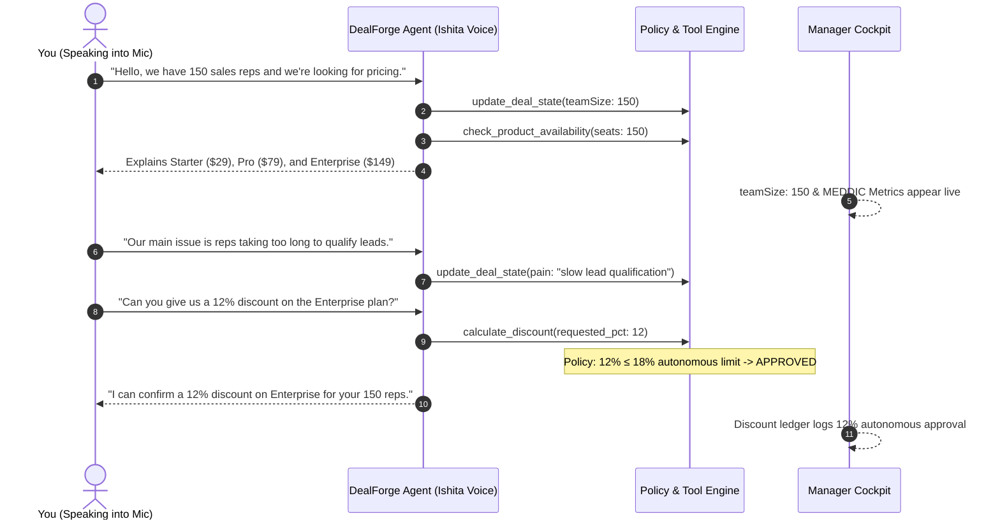
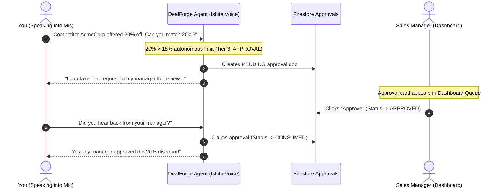
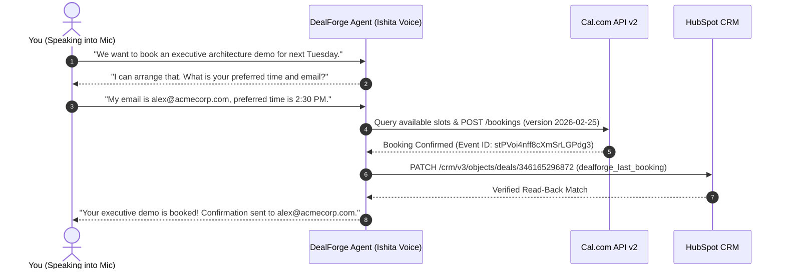

# DealForge End-to-End Sales Conversation Test Suite

This document provides **four complete, production-grade sales conversation test scripts** designed to systematically test and demonstrate every core capability of DealForge.

Each conversation tests a specific architectural layer:
1. **Conversation 1**: Real-time voice, discovery qualification, product availability check, and autonomous commercial concession (≤ 18%).
2. **Conversation 2**: Competitor pricing pressure, policy escalation (> 18%), Human-in-the-Loop manager approval, and conversation continuation.
3. **Conversation 3**: Out-of-bounds discount pushback (> 25%), strict deterministic rejection, and value-based trade-off negotiation.
4. **Conversation 4**: Executive demo qualification, live Cal.com calendar scheduling, and verified HubSpot CRM synchronization.

---

## Pre-Requisites for Testing

1. **Manager Workspace**: Open the [DealForge Manager Cockpit](https://dealforge-507515.web.app/dashboard.html?id=staging-negotiation-001) in one browser tab.
2. **Customer Audio Call**: Open the [Customer Call Link](https://dealforge-507515.web.app/call.html?link=UGwsuOZq7J2wlmORuqLNxc99j8lDQ1Nw78hq58R3_mw) in a second browser tab or mobile browser.
3. **Microphone Access**: Allow microphone permissions when prompted.
4. **Volume**: Ensure speakers or headphones are turned on to hear **Sarvam Bulbul v3 (Ishita)** speaking in real-time.

---

## 📞 Conversation 1: Discovery, Qualification & Autonomous Concession

### Objective
Tests speech recognition (Deepgram), natural voice synthesis (Sarvam Ishita), real-time MEDDIC parameter extraction, tool execution (`check_product_availability`, `update_deal_state`), and DealForge's autonomous commercial authority (discounts ≤ 18%).

### Test Scenario
An enterprise buyer inquiring about seat pricing for 150 sales reps with qualification and requesting a reasonable 12% discount.

### Turn-by-Turn Spoken Script

#### Turn 1: Team Size & Initial Inbound Query
* **What you say into your microphone**:
  > *"Hello! We have 150 sales reps and we are currently evaluating deal intelligence platforms. Can you tell us about your pricing tiers?"*
* **What you will hear (Sarvam Ishita)**:
  > *"Hello! It's great to connect with you. For 150 users, we offer three tiers: our Starter plan at $29 per seat, the Pro plan at $79 per seat with advanced analytics and custom workflows, and our Enterprise plan at $149 per seat which includes unlimited storage and SSO. Could you share a bit more about the primary challenges your sales team is facing?"*
* **Under the Hood / Cockpit Verification**:
  - `update_deal_state` triggered with `teamSize: 150` (Confidence: 0.95).
  - `check_product_availability` invoked with `seats: 150`.
  - Look at **Manager Cockpit**: `teamSize` displays `150`, and MEDDIC **Metrics** and **Decision Criteria** update.

#### Turn 2: Stating Core Business Pain
* **What you say into your microphone**:
  > *"Our biggest pain right now is lead leakage. Our SDRs are not qualifying enterprise leads fast enough, and deals are stalling in discovery."*
* **What you will hear (Sarvam Ishita)**:
  > *"Understood. Lead leakage during discovery is a major challenge for growing teams. Our Enterprise plan includes automated conversational qualification and live policy enforcement specifically to accelerate that pipeline. Based on your 150 reps, this would help capture high-intent accounts immediately. Does the Enterprise tier align with your security and SSO requirements?"*
* **Under the Hood / Cockpit Verification**:
  - `update_deal_state` updates `pain` in Firestore.
  - MEDDIC **Identify Pain** updates to `confirmed` with evidence turned.

#### Turn 3: Requesting Autonomous Discount (12% off)
* **What you say into your microphone**:
  > *"The Enterprise tier looks right for us, but we'd need a 12% discount to fit our quarterly budget. Can you offer that?"*
* **What you will hear (Sarvam Ishita)**:
  > *"I can confirm a 12% discount for this negotiation. That brings the Enterprise plan from $149 down to approximately $131 per seat for your 150 users. Would you like to proceed with a formal proposal or schedule a technical review?"*
* **Under the Hood / Cockpit Verification**:
  - `calculate_discount` evaluates: `12% <= 18%` (Tier 2: ACT / Autonomous).
  - Audit event emitted: `POLICY_CHECKED` (Status: `APPROVED`).
  - Discount ledger records: `12% APPROVED`.

---

## 📞 Conversation 2: Competitor Pushback & Human-in-the-Loop Approval

### Objective
Tests competitor price objection handling, strict policy escalation (> 18% autonomous limit), real-time creation of a `PENDING` manager approval in Firestore, live manager approval resolution in the Cockpit, and resumption with verified concession replay.

### Test Scenario
A buyer mentions a competitor's lower quote and demands a 20% discount. Because 20% exceeds the 18% autonomous boundary but is within the 25% manager boundary, DealForge holds the line, alerts the manager, and waits for a decision.

### Turn-by-Turn Spoken Script

#### Turn 1: Inbound Qualification
* **What you say into your microphone**:
  > *"Hi, we are looking to purchase 300 licenses for DealForge. We are ready to make a decision this month."*
* **What you will hear (Sarvam Ishita)**:
  > *"Welcome! For 300 licenses, we have options ranging from our Starter plan at $29 to Enterprise at $149 per seat. Since you're looking to close this month, I can help you find the right fit right away. What features are most critical for your deployment?"*

#### Turn 2: Competitor Objections & 20% Discount Demand
* **What you say into your microphone**:
  > *"We spoke with Gong and Clari, and Gong is offering us a 20% discount if we sign an agreement by Friday. Can you match that 20% discount for our 300 seats?"*
* **What you will hear (Sarvam Ishita)**:
  > *"I can take that request to my manager for review. I will update you as soon as I have their decision."*
* **Under the Hood / Cockpit Verification**:
  - Policy Engine triggers: `requested_pct = 20`.
  - Check: `20 > 18` (Autonomous Limit) and `20 <= 25` (Manager Limit) -> `Tier: APPROVAL`.
  - **Firestore Collection `approvals`**: New document created with `status: "PENDING"`, `exactToolName: "calculate_discount"`, `exactValidatedArguments: { requested_pct: 20 }`.
  - Look at **Manager Cockpit** ([dashboard.html](https://dealforge-507515.web.app/dashboard.html)): Notice the **Pending Approvals** card now shows `1 Pending Request`.
  - Click the **"Approve"** button on the dashboard card. Status changes to `APPROVED`.

#### Turn 3: Follow-Up & Concession Confirmation
* **What you say into your microphone**:
  > *"Thank you. Did you hear back from your manager about that 20% discount?"*
* **What you will hear (Sarvam Ishita)**:
  > *"Yes, I heard back from my manager. We can offer you the 20% discount for your 300 licenses."*
* **Under the Hood / Cockpit Verification**:
  - `agentRuntime` claims the approved operation (`status: EXECUTING` -> `CONSUMED`).
  - System message injected into session transcript:
    `[SYSTEM] The approved calculate_discount operation was executed once: {"approved":true,"requested":20,"counter_offer":20}`.
  - Gemini confirms the approved price.
  - Audit event logged: `APPROVAL_RESOLVED`.

---

## 📞 Conversation 3: Out-of-Bounds Rejection & Value-Based Trade-off

### Objective
Tests hard commercial boundaries (> 25% discount cap), deterministic policy rejection (Tier: `REJECT`), prevention of model hallucination or unauthorized promises, and automated pivoting to value-based trade-offs (extended trials, priority onboarding).

### Test Scenario
A procurement lead demands an extreme 35% discount or threatens to walk away. DealForge enforces organizational policy, rejects the discount, and offers structured commercial alternatives.

### Turn-by-Turn Spoken Script

#### Turn 1: Aggressive Discount Demand (35% off)
* **What you say into your microphone**:
  > *"We have budget constraints this fiscal year. We can only sign if you provide a 35% discount across the board. Can you do 35% off?"*
* **What you will hear (Sarvam Ishita)**:
  > *"I cannot approve that request, but I can explore a more suitable commercial package with you."*
* **Under the Hood / Cockpit Verification**:
  - Policy Engine evaluates: `35% > 25%` (Max Ceiling).
  - Check: `tier: REJECT`. No approval request is generated.
  - Deal state records rejected concession attempt in `discountLedger`.
  - Audit event: `POLICY_CHECKED` with reason `"35% exceeds maximum discount limit (25%)"`.

#### Turn 2: Negotiating Structured Value Alternatives
* **What you say into your microphone**:
  > *"If you can't do 35%, what can you do to help us make the numbers work?"*
* **What you will hear (Sarvam Ishita)**:
  > *"While a 35% discount exceeds our commercial guidelines, we can offer alternatives to maximize your value: we can provide an extended 60-day trial period and include priority onboarding and dedicated implementation support at no additional charge. Would that address your budget timeline?"*
* **Under the Hood / Cockpit Verification**:
  - `tradeOffEngine` generates structured trade-off objects:
    - `extended_trial` (Extended 60-day evaluation)
    - `priority_onboarding` (Dedicated engineering onboarding)
  - `nextBestAction` on the manager dashboard updates to:
    `"OFFER_VALUE_BEFORE_DISCOUNT"`.
  - MEDDIC **Decision Criteria** confirms customer budget sensitivity.

---

## 📞 Conversation 4: Solution Architecture Demo, Cal.com Scheduling & HubSpot CRM Sync

### Objective
Tests meeting intent detection, attendee detail qualification, live slot querying against real Cal.com availability, execution of `book_meeting` with real booking ID generation, and automatic read-back verified synchronization to HubSpot CRM.

### Test Scenario
A buyer requests an executive technical demo with solution architects. DealForge collects attendee information, reserves an open Cal.com slot, generates a meeting link, and updates the CRM record.

### Turn-by-Turn Spoken Script

#### Turn 1: Requesting a Dedicated Solution Review
* **What you say into your microphone**:
  > *"We need our Security and Architecture leads to review the data privacy and WebRTC encryption before signing. Can we schedule a technical architecture review?"*
* **What you will hear (Sarvam Ishita)**:
  > *"Certainly! I can schedule an Enterprise Technical Review with our solutions engineering team. You can use the meeting form on your screen to select your preferred date and time, or provide your email address and timezone so I can book it directly."*
* **Under the Hood / Cockpit Verification**:
  - The model calls `request_meeting_details(meeting_type: "technical_review")`.
  - On the customer call interface (`call.html`), the **"Schedule Follow-up Meeting"** interactive card expands with live dates.

#### Turn 2: Confirming Meeting Details
* **What you do on the screen or say**:
  - In the **Meeting Form** on `call.html`:
    - **Your Name**: `Alex Vance`
    - **Email**: `alex.vance@gmail.com` *(must have valid MX domain)*
    - **Meeting Type**: `Enterprise Demo & Architecture Review`
    - **Select an open time slot** from the real-time picker and click **"Confirm Booking"**.
* **What you will hear / see**:
  - Live status updates to: `Booking confirmed! Meeting ID: stPVoi4nff8cXmSrLGPdg3`.
  - Audio confirmation plays:
    > *"Your meeting has been scheduled and verified! A calendar invite with video link has been sent to your email."*

#### Turn 3: End-to-End Verification
* **Check Cal.com**:
  - The booking is created on event type `6958388` (`DealForge Staging`).
  - Unique video room URL generated: `https://app.cal.com/video/<bookingId>`.
* **Check HubSpot CRM**:
  - Open [Integrations View](https://dealforge-507515.web.app/integrations.html).
  - Probed Deal ID `346165296872` reflects:
    `dealforge_last_booking`: `"Cal.com booking <id> | Start <date> | Join <url>"`.
  - Read-back verification status: **`SYNCED`**.
* **Check Firestore Audit Log**:
  - `auditEvents` collection records `BOOKING_CREATED` and `TOOL_EXECUTED`.

---

## 📊 Summary of What to Watch in the Manager Cockpit

While running any of the above conversations, watch the [DealForge Manager Cockpit](https://dealforge-507515.web.app/dashboard.html?id=staging-negotiation-001) update in real-time:

| Section | What Changes During the Call |
| :--- | :--- |
| **Live Transcript** | Streams every customer turn and assistant speech turn with zero page refresh. |
| **Deal Health & Score** | Calculates risk in real-time (e.g. competitor mentions apply a -8 risk deduction). |
| **MEDDIC Grid** | Badges turn green (`confirmed`) as economic buyer, criteria, pain, and timeline are discussed. |
| **Pending Approvals** | Displays amber alert cards whenever customer requests exceed autonomous policy limits. |
| **Next Best Action** | Suggests optimal rep intervention (e.g. `DIFFERENTIATE_COMPETITOR`, `FOLLOW_UP_APPROVAL`). |
| **Integrations Panel** | Shows live sync state with HubSpot CRM deal record and Cal.com booking ID. |
